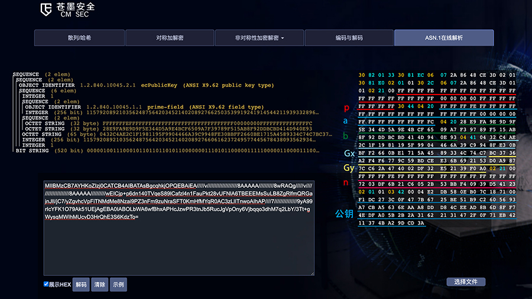

### 椭圆曲线加解密(国密)：SM2，不依赖第三方库OpenSSL实现(O2SECCKit)

> 目前只实现了素数域椭圆曲线(y^2 = x^3 + ax + b)的SM2加解密、签名和验签及SM3的Hash摘要  
> 椭圆曲线分为：  
> 
> * Fp(素数域)椭圆曲线 y^2 = x^3 + ax + b,素数域曲线应该已经够用了  
> * F2m(二元扩域)椭圆曲线 y^2 + xy = x^3 + ax^2 + b
>
>二元扩域曲线及SM4对称加密，后续抽空实现
>

开源此组件**O2SECCKit** [github](https://github.com/o2space/O2SECCKit)

#### 一、集成步骤  

通过Cocoapods集成

```
//在 Podfile 文件中添加命令：
pod 'O2SECCKit'
```

#### 二、使用说明  

```
// 引入SDK
#import <O2SECCKit/O2SECCKit.h>
//对外开放功能类O2SSMxHelper
```
**加解密**

```
//sm2 加密
NSString *plainText = [NSString stringWithFormat:@"hello world 哈哈"];
NSData *plainData = [plainText dataUsingEncoding: NSUTF8StringEncoding];
//公钥
NSString *publicKey = @"34B3C792B462041066F697B1018C4A96E615EE889A33FFDF8F870BC1662A4234091F5D6D4220AFDAF0041B9CA7DD880016A90F246C26F173DD61BA371D376E26";
O2SSM2Cipher *cipher = [O2SSM2Cipher EC_Fp_X9_62_256V1];//这里是Fp通用曲线，可自定义椭圆曲线系统
NSData *cipherData = [O2SSMxHelper sm2DoEncrypt:plainData publicKey:publicKey cipher:cipher cipherMode:O2SSM2CipherModeC1C2C3];//加密

//sm2 解密
//私钥
NSString *privateKey = @"EFA93286160DFDE76C876A6A994DD334624044270BB27C218AE9272A597BE5DA";
//使用跟加密相同的椭圆曲线及系数
NSData *m = [O2SSMxHelper sm2DoDecrypt:cipherData privateKey:privateKey cipher:cipher cipherMode:O2SSM2CipherModeC1C2C3];//解密

```

**签名、验签**

```
NSString *userId = @"o2space@163.com";
NSString *srcStr = @"ABCDEFG1234566 Hello world, 中文";
NSData *srcData = [srcStr dataUsingEncoding: NSUTF8StringEncoding];

//sm2 签名
NSString *p =   @"8542D69E4C044F18E8B92435BF6FF7DE457283915C45517D722EDB8B08F1DFC3";
NSString *a =   @"787968B4FA32C3FD2417842E73BBFEFF2F3C848B6831D7E0EC65228B3937E498";
NSString *b =   @"63E4C6D3B23B0C849CF84241484BFE48F61D59A5B16BA06E6E12D1DA27C5249A";
NSString *Gx =  @"421DEBD61B62EAB6746434EBC3CC315E32220B3BADD50BDC4C4E6C147FEDD43D";
NSString *Gy =  @"0680512BCBB42C07D47349D2153B70C4E5D7FDFCBFA36EA1A85841B9E46E09A2";
NSString *n =   @"8542D69E4C044F18E8B92435BF6FF7DD297720630485628D5AE74EE7C32E79B7";
//自定义Fp椭圆曲线系数
O2SSM2Cipher *cipher = [[O2SSM2Cipher alloc] initWithFpParamPHex:p aHex:a bHex:b gxHex:Gx gyHex:Gy nHex:n];
//私钥
NSString *privateKey = @"128B2FA8BD433C6C068C8D803DFF79792A519A55171B1B650C23661D15897263"; 
NSData *signData = [O2SSMxHelper sm2DoSignUserId:userId srcData:srcData privateKey:privateKey cipher:cipher];

//sm2 验签
//cipher与签名时的椭圆曲线及系数相同
//公钥
NSString *publicKey = @"0AE4C7798AA0F119471BEE11825BE46202BB79E2A5844495E97C04FF4DF2548A7C0240F88F1CD4E16352A73C17B7F16F07353E53A176D684A9FE0C6BB798E857";
BOOL verify = [O2SSMxHelper sm2DoVerifyUserId:userId srcData:srcData publicKey:publicKey cipher:cipher sign: signData];
NSLog(@"%@",verify?@"验签成功":@"验签失败");
```

**sm2随机生成公私钥**

```
//O2SSM2Cipher类
//在Fp椭圆对应系数的曲线下 随机生成一对公私钥
NSDictionary *keyPair = [O2SSM2Cipher EC_Fp_SM2_256V1].generateKeyPairHex;
NSLog(@"publicKey:%@",keyPair[@"publicKey"]);
NSLog(@"privateKey:%@",keyPair[@"privateKey"]);
```

**sm3 HASH摘要**

```
NSString *sourceStr = @"中文";
NSData *data = [O2SSMxHelper sm3DoHashWithString:sourceStr];
NSLog(@"SM3 HASH：%@",[O2SSMxUtils hexStringByData:data]);
```

#### 三、注意事项
1、提供公钥der文件，内部包含公钥值、椭圆曲线及椭圆曲线相关系数(p,a,b,Gx,Gy,n)，可通过[在线工具](https://aks.jd.com/tools/sec/)ASN.1在线解析，**"O2SECCKit"**内部没有ASN.1,请自行解析。  

**公钥文件或Base64:**  

  

**私钥文件或Base64:**  
> 私钥文件中，可能含有公钥 

  


#### 四、相关备注和总结

**sm2 公式:**

```
//无论RSA还是SM2，加解密问题，一切都归于数学问题，涉及“大数“运算，字符串可以用“大数”表示，加解密无非就是 ”大数“变成另一个”大数“
//一个字符串NSString(如"hello world") 转成 NSData，NSData转换成 16进制的字符串(如"68656C6C6F20776F726C64")，这个l6进制字符串就是一个16进制”大数“
//大数运算 如："C8" + "A3" = "016B"
//
//SM2 加解密
//备注：椭圆曲线坐标点运算 详情EC_Fp
//注：这里的坐标点如G点，Q点及椭圆曲线生成的点当作大数处理 如：规定每个点为16进制4位{"00ff","f840"}那么值就是“00fff840”,之后通过位数重新切分成点
//1、选定一条椭圆曲线Ep(a,b) 并取椭圆曲线上一点，作为基点G
//2、选择一个大数k作为私钥，并生成公钥 Q = kG
//3、Ep(a,b)和n、G点、Q点提供给客户端这几个参数经过ASN.1编码生成der即为"公钥" 备注：der不一定明确的含Ep(a,b)和G点的值，Q值一定有，根据内部类型值也可确定椭圆曲线
//4、Ep(a,b)和n、G点、k值提供给服务端这几个参数经过ASN.1编码生成der即为"私钥" 备注：der不一定明确的含Ep(a,b)和G点及Q点的值，k值一定有，根据内部类型值也可确定椭圆曲线，"私钥"信息包含“公钥”，Q = kG 计算得到，
//      一般提供的der文件密钥可通过https://aks.jd.com/tools/sec/ ASN.1在线解析工具获取相关的p、a、b、G点、n的值以及Q点或k
//5、加解密原理解释例子：
//  M为明文,r是随机一个“大数” C1 = rG，C1为随机点，Q为公钥点,C2 = M⊕rQ (实际为 C2 = M⊕KDF(rQ,ml) 看：♦️)， r∈[1，n-1]
//  公钥加密：密文C是C1,C2,C3组合的字节流 C = C1+C2+C3,
//  私钥解码：求M ∵ 已知 C1 = rG,C2 = M⊕rQ,Q = kG, C1 = rG
//              ∵ 椭圆曲线特性(Fp域内运算满足交换律、结合律、分配律) rQ = r(kG) = k(rG) = kC1
//              ∴ 结果：rQ = kC1
//              ∵ M = (M⊕rQ)⊕rQ = (C2)⊕kC1,  一般是使用⊕(异或)处理,原因(a⊕b)⊕b == a
//              ∴ 结果：M = (C2)⊕kC1（实际为M = C2⊕KDF(kC1,ml)看：♦️）,C2(密文C获取 已知),k(服务器私钥 已知)和C1(密文C获取 已知)
//
//  ♦️注意：上方 C2 = M⊕rQ 改成 C2 = M⊕KDF(rQ,ml)，M = (C2)⊕kC1 改成 M = C2⊕KDF(kC1,ml) ，C2.len == M.len【别名ml】 == KDF(rQ,ml).len == KDF(kC1,ml).len，长度值相等
//         上方 C1 = rG 一般情况下前面还要加上0x04表示未压缩形式(C1 = 0x04+rG)
//  C3 = HASH_SM3(rQx+M+rQy)
//
//      |---   64 byte C1  ---||--- M(len) C2---||------ 32 byte C3 ------|
//      |                     ||                ||                        |
//      |----x1----|----y1----||                ||                        |
//      |          |          ||                ||                        |
//  C = F0...................0802..............C9A1......................B8
//  注意C1的长度与坐标点长度相等
//
// 以上"+"基本是字符串拼接

//假设在加密过程中，有一个第三者H，H只能知道椭圆曲线 Ep(a,b)、公钥Q、基点G、密文C，而通过公钥Q、基点G求私钥k或者通过密文点C、基点P求随机数r都是非常困难的，因此得以保证数据传输的安全
//
//下面的加解密使用的是Fp上的椭圆曲线(p是大于3的素数，y^2 = x^3 + ax + b, a,b∈Fp,且(4a^3 + 27b^2) mod p = 0),非F2m上的椭圆曲线(y^2 + xy = x^3 + ax^2 + b, a,b∈F2m,且b=0)。
//
// asn.1解码 03 42 00
//      03是bit string的tag
//      42是bit string的length
//      00是bit string的unused bit
//      04说明是没有压缩的
//      剩下为公钥point值
```
**Fp(素数域)上的椭圆曲线 y^2 = x^3 + ax + b :**

```
//Fp(素数域)上的椭圆曲线 y^2 = x^3 + ax + b
//椭圆曲线E (Fp )上的点按照下面的加法运算规则，构成一个交换群:
//a) O+O=O;
//b) ∀P = (x,y) ∈ E(Fp)\{O}，P+O = O+P = P;
//c) ∀P = (x,y) ∈ E(Fp)\{O}，P的逆元素−P = (x,−y)，P+(−P) = O;
//d) 两个非互逆的不同点相加的规则:
//   设P1 = (x1,y1) ∈ E(Fp)\{O}，P2 = (x2,y2) ∈ E(Fp)\{O}，且x1 ≠ x2，
//   设P3 = (x3,y3)=P1+P2，则
//         x3 =λ^2 − x1 − x2,
//         y3 =λ(x1 − x3) − y1
//     其中
//                y2 − y1
//            λ = ———————  ;
//                x2 − x1
//e) 倍点规则:
//   设P1 = (x1,y1) ∈ E(Fp)\{O}，且y1 ≠ 0，P3 = (x3,y3) = P1 +P1，则
//         x3 =λ^2−2x1,
//         y3 =λ(x1−x3)−y1,
//     其中
//                 3x1^2 + a
//             λ = —————————  。
//                    2y1

```

**点压缩 (y^2) mod n = a mod n 需要使用到模平方根运算:**

>所谓点压缩就是，已知椭圆曲线及系数、点x值，求y。  
>(y^2) mod p = (x^3 + ax + b) mod p,其中p、x、a、b求y

```
// 参考的轮子：https://blog.csdn.net/qq_41746268/article/details/98730749
//对于给定的奇质数p，和正整数x,存在y满足1≤y≤p−1，且x≡y^2(mod p)x，则称y为x的模平方根
//对于正整数m,若同余式,若同余式x^2≡a(mod m)有解，则称a为模m的平方剩余，否则称为模m平方非剩余。
//是否存在模平方根
//根据欧拉判别条件:
//设p是奇质数，对于x^2≡a(mod p)
//a是模p的平方剩余的充要条件是(a^((p−1)/2)) % p = 1
//a是模p的平方非剩余的充要条件是(a^((p−1)/2)) % p = -1
//给定a,na,na,n(n是质数)，求x^2≡a(mod n)的最小整数解x
//代码复杂度O(log2(n))
```

#### 五、参考文献
1、[https://aks.jd.com/tools/sec/](https://aks.jd.com/tools/sec/)，在线加密工具及ASN.1解析    
2、[C大数运算](https://github.com/libtom/libtommath)    
3、[nodejs miniprogram-sm-crypto](https://github.com/wechat-miniprogram/sm-crypto) 基本参考此项目转成OC  
4、[收集的github下的关于椭圆曲线文档](https://github.com/o2space/O2SECCKit/参考文献)  
5、SM3 C实现的HASH摘要，链接地址未找到，用了别人造的轮子。  
6、[点压缩 涉及模平方根](https://blog.csdn.net/qq_41746268/article/details/98730749)